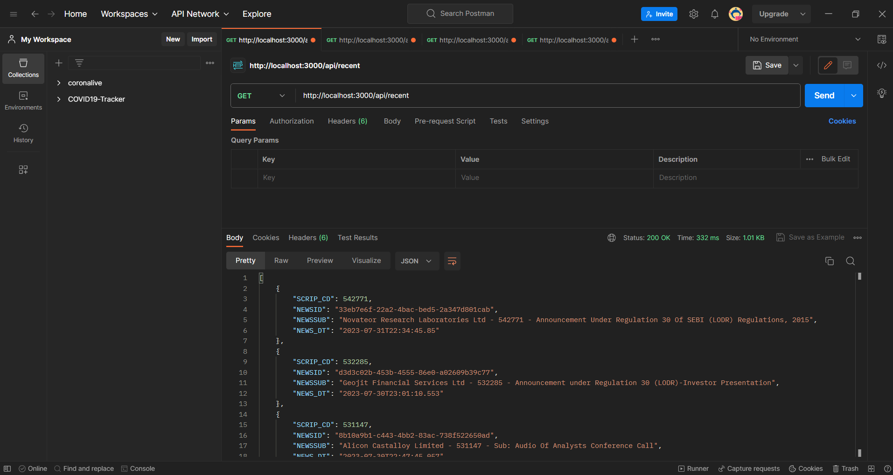
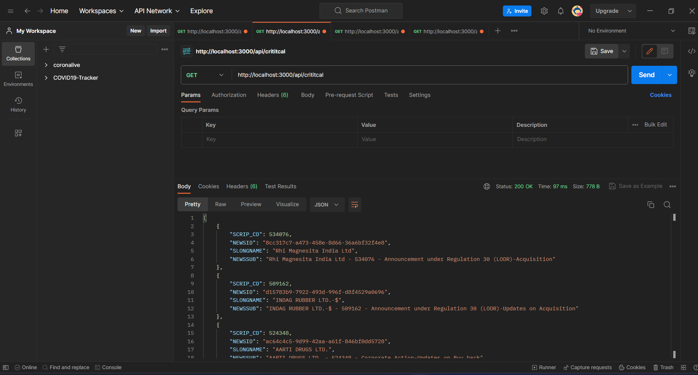
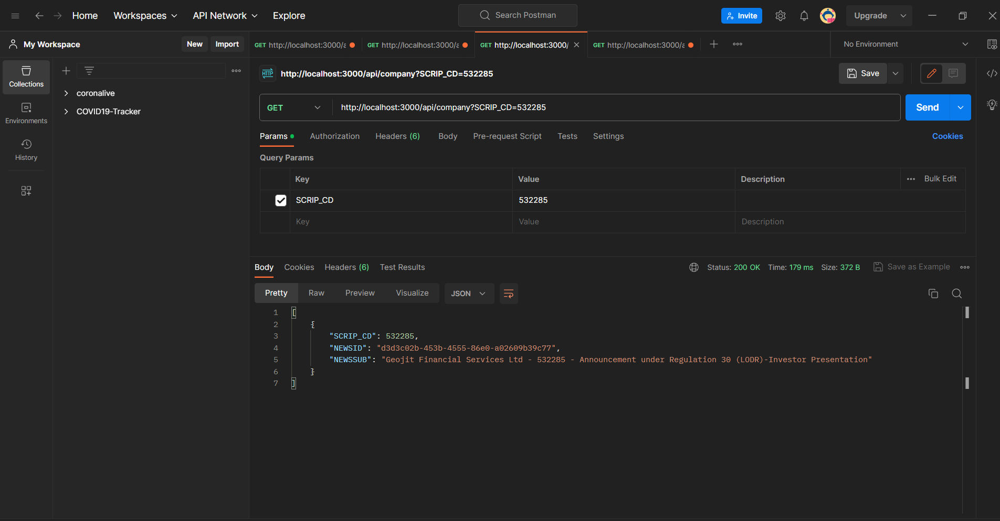
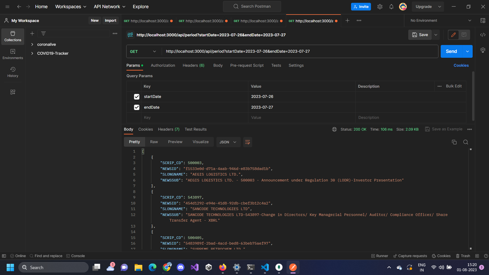

<!DOCTYPE html>
<html>

<head>
    <title>Market Project API</title>
</head>

<body>

    <h1>Market Project API</h1>

    <h2>How to Start and Run the Project</h2>
    
To start and run the project, follow these steps:

    <ol>
        <li>Clone the repository to your local machine.</li>
        <li>Install the required dependencies by running <code>npm install</code> in the project directory.</li>
        <li>Start the development server by running <code>npm run dev</code>.</li>
    </ol>

     

    <h2>APIs</h2>
    
The following APIs have been created:

    <ul>
        <li><strong>GET /api/company</strong>: Get announcements for a specific company (stock) based on the SCRIP_CD
            parameter. Example: <a href="http://localhost:3000/api/company?SCRIP_CD=532285">http://localhost:3000/api/company?SCRIP_CD=532285</a>
        </li>
        <li><strong>GET /api/critical</strong>: Get critical announcements for all companies. Example: <a
                href="http://localhost:3000/api/critical">http://localhost:3000/api/critical</a></li>
        <li><strong>GET /api/period</strong>: Get announcements within a specified date range using the startDate and
            endDate parameters. Example: <a
                href="http://localhost:3000/api/period?startDate=2023-07-26&endDate=2023-07-27">http://localhost:3000/api/period?startDate=2023-07-26&endDate=2023-07-27</a>
        </li>
        <li><strong>GET /api/recent</strong>: Get announcements from the past 1-2 days in descending time order.
            Example: <a href="http://localhost:3000/api/recent">http://localhost:3000/api/recent</a></li>
    </ul>
     
    <h2>Postman Screenshots</h2>
    
Here are the Postman screenshots for the APIs:

    
    
    
    

</body>

</html>
